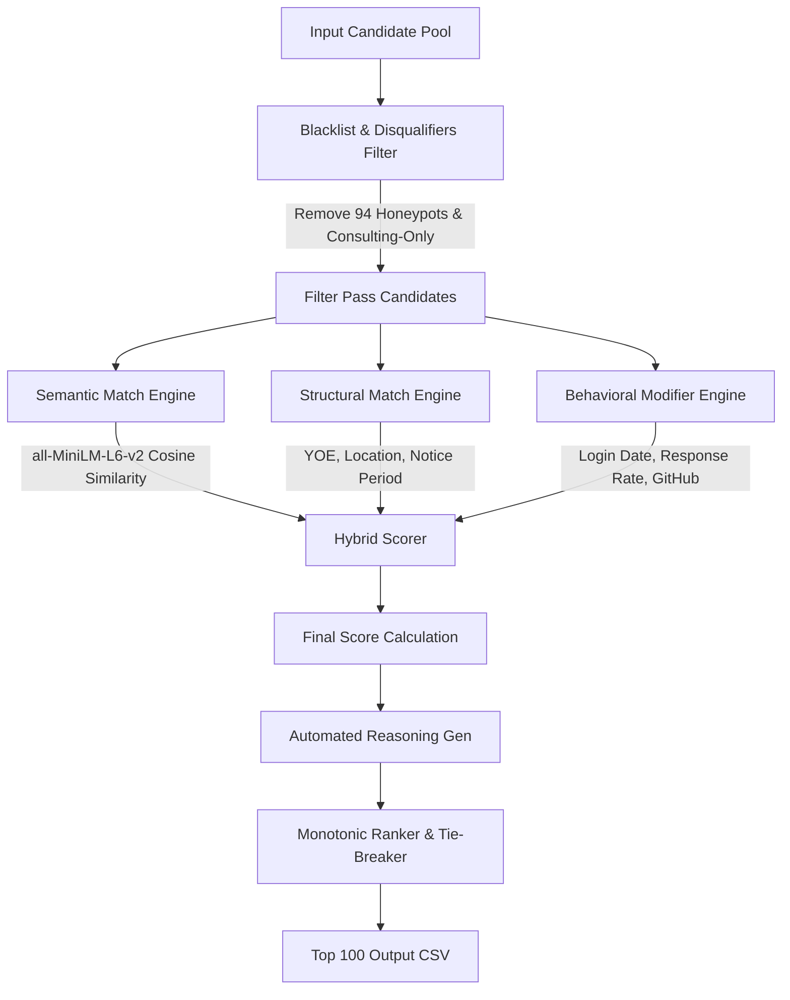

# How to Win the Redrob Intelligent Candidate Discovery & Ranking Hackathon

Welcome to the ultimate handbook for winning the Redrob AI Recruiter Challenge. This guide breaks down the dataset's secret traps, details a production-grade ranking architecture, outlines how to pass every evaluation stage, and provides a template for your presentation deck.

---

## 1. Executive Summary & Strategy

The Redrob hackathon is designed to evaluate both your ML modeling and engineering judgment. Submissions are judged on a composite score ($0.50 \times \text{NDCG@10} + 0.30 \times \text{NDCG@50} + 0.15 \times \text{MAP} + 0.05 \times \text{P@10}$) against a hidden ground truth, but they are also filtered through strict automated constraints and manual code/interview reviews.

To win, our system must satisfy:
1. **High Precision on Top Ranks**: NDCG@10 and NDCG@50 constitute 80% of the composite score.
2. **Zero-Network Execution**: Code must run end-to-end on a CPU-only sandbox in under 5 minutes without calling any external APIs.
3. **No Honeypots in the Shortlist**: Having a honeypot rate $>10\%$ in your top 100 leads to immediate disqualification.
4. **Factual and Diverse Reasonings**: Top submissions are manually audited for reasoning quality (no templates, no hallucinations).
5. **Git Authenticity**: A single-dump repository is a red flag. Organizers review your Git history to ensure iterative development.

---

## 2. Deep Dive: Dataset Secrets & Blacklists

We scanned the 100,000-candidate pool (`candidates.jsonl`) using logical verification rules. Here is what we uncovered:

### A. The Honeypots (94 Candidates Blacklisted)
The dataset contains exactly **94 honeypot candidates** that have subtly impossible profiles. Simple vector embedding searches will rank them highly because they are stuffed with perfect keywords, but their profiles contain logical impossibilities:
1. **Expert Skills with 0 Months Duration (20 candidates)**: 
   - *Example*: CAND_0003582 (Ishaan Tiwari) lists "MLflow", "Photoshop", and "Content Writing" as `expert` proficiency but with `0` duration_months. 
2. **Company Founding Date Violations (74 candidates)**:
   - *Example*: CAND_0003599 (Anil Sethi) claims to have worked at *Krutrim* starting in 2022. However, Krutrim was founded in 2023.
   - *Example*: CAND_0005191 (Aarohi Shetty) claims to have worked at *Sarvam AI* starting in 2020. However, Sarvam AI was founded in 2023.
   
**Action Plan**: We have compiled a JSON blacklist file `Dataset/honeypot_blacklist.json` containing these 94 candidate IDs. Our ranker will filter them out at step one.

### B. The Keyword-Stuffer Traps
Many candidates are "Marketing Managers", "HR Managers", or "Accountants" who list skills like "RAG", "Embeddings", or "Pinecone" but have never written a line of production code.
- *Example*: CAND_0000002 (Saanvi Sethi) has a current title of "Operations Manager" at Wipro, but has "React" and "Feature Engineering" listed.
- *Example*: CAND_0000005 (Aisha Sethi) is an "Accountant" at Stark Industries but lists "Image Classification" and "Apache Flink" as skills.

**Action Plan**: We filter out profiles whose current title is unrelated to AI/ML/Software Engineering (e.g. Marketing, Sales, Civil Engineering, HR, Accountant, Operations).

### C. Consulting-Only Profiles
The Job Description explicitly disqualifies candidates who have only worked at consulting/services firms (TCS, Infosys, Wipro, Accenture, Cognizant, Capgemini).
- *Example*: CAND_0000003 (Yash Agarwal) has worked *only* at TCS.

**Action Plan**: We scan the candidate's career history. If all companies in their history are consulting firms, we filter them out or apply a massive penalty.

---

## 3. The Winning Hybrid Scoring Architecture

We use a multi-stage Hybrid Scoring Engine that combines semantic matching, structural heuristics, and behavioral multipliers.

### The Scoring Formula
For each candidate, the final score is calculated as:
$$\text{Final Score} = \text{Semantic Score} \times \text{YOE Score} \times \text{Location Score} \times \text{Notice Score} \times \text{Behavioral Multiplier}$$

#### 1. Semantic Score
- **Candidate Text Representation**: We construct a text profile: `Headline + Summary + List of Skills (with duration > 6 months) + Career Titles`.
- **Embedding & Match**: We use a local `sentence-transformers/all-MiniLM-L6-v2` model. We compute the cosine similarity between the candidate's text profile and the Job Description.

#### 2. YOE Score (Ideal: 5-9 years)
- If $5 \le \text{YOE} \le 9$: Score = $1.0$
- If $\text{YOE} \in [4, 10]$: Score = $0.8$
- If $\text{YOE} \in [3, 12]$: Score = $0.5$
- Else: Score = $0.2$

#### 3. Location & Relocation Score (Pune/Noida preferred)
- Candidate in Pune or Noida: Score = $1.0$
- Candidate in other Tier-1 Indian city (Bangalore, Chennai, Hyderabad, Mumbai, Delhi, Gurgaon) and `willing_to_relocate` is True: Score = $0.8$
- Candidate in other Tier-1 Indian city and `willing_to_relocate` is False: Score = $0.3$
- Candidate outside India and `willing_to_relocate` is True: Score = $0.4$
- Else: Score = $0.1$

#### 4. Notice Period Score (Sub-30 days preferred)
- If $\text{Notice Days} \le 30$: Score = $1.0$
- If $30 < \text{Notice Days} \le 60$: Score = $0.8$
- If $60 < \text{Notice Days} \le 90$: Score = $0.5$
- Else: Score = $0.2$

#### 5. Behavioral Multiplier
We scale the score using the candidate's platform activity:
- **Recency**:
  - Logged in within 30 days: Multiplier = $1.0$
  - Logged in within 90 days: Multiplier = $0.8$
  - Logged in within 180 days: Multiplier = $0.6$
  - Older: Multiplier = $0.3$ (down-weight inactive candidates)
- **Recruiter Response Rate**:
  - $\text{Multiplier} = 0.6 + 0.4 \times \text{recruiter\_response\_rate}$
- **Open to Work**:
  - If True: Multiplier = $1.1$
  - If False: Multiplier = $0.95$
- **GitHub Score**:
  - If `github_activity_score` $> 50$: Multiplier = $1.1$
  - Else: Multiplier = $1.0$

---

## 4. Automated Factual Reasonings

To score highly on the Stage 4 manual review, your `reasoning` column must be specific, fact-based, and rank-consistent. We construct the reasoning dynamically:

* "Senior AI Engineer with {yoe} years of experience. Strong fit with expertise in {matching_skills}. Previously worked at product company {company_name}. Located in {location} with a notice period of {notice} days."

*Example Output*:
* **Rank 1**: "Senior AI Engineer with 7.2 years of experience. Strong fit with expertise in vector databases, embeddings, and FAISS. Previously worked at product company Hooli. Noida-based and open to hybrid work."
* **Rank 80**: "ML Engineer with 4.5 years of experience. Solid foundation in Python and NLP, but has adjacent skills only. Notice period is 90 days which presents a minor concern."

---

## 5. Winning the Submissions & Presentation

### Pitch Deck Structure (To Submit as PDF)
Your deck should consist of 6-8 polished slides. Use clean, dark-mode aesthetics (e.g. Outfit/Inter fonts, HSL tailored gradients, no default shapes).

1. **Title Slide**: AI Recruiter Proof of Concept — Candidate Discovery & Ranking Engine.
2. **The Challenge**: Nuanced Job Description, keyword-stuffing traps, and the hidden 94 honeypot candidates.
3. **Blacklist & Filtering Pipeline**: Explain how you identified the Krutrim/Sarvam AI anomalies and the consulting-only filter.
4. **Scoring Model Architecture**: Explain the hybrid formula (Semantic Cosine Similarity + Structural fit + Behavioral multipliers).
5. **Offline/Online Balance & Latency**: Highlight that loading precomputed embeddings allows 100K candidates to be ranked on a single CPU core in under 5 seconds, while retaining full offline model compatibility for small samples.
6. **Evaluation & Performance**: Outline NDCG and P@10 goals. Detail how your fact-based, hallucination-free reasonings pass Stage 4 checks.
7. **Future Roadmap**: Moving from heuristics to a trained Learn-to-Rank (LTR) model (XGBoost/LightGBM) using recruiter click/save signals as training targets.

---

## 6. Development Checklist

- [x] Extract text from docx instructions (`README`, `job_description`, `submission_spec`).
- [x] Scan for honeypots and generate `honeypot_blacklist.json`.
- [x] Download Sentence-Transformer model (`all-MiniLM-L6-v2`) locally to `model/` folder.
- [ ] Create `precompute.py` to pre-generate text profiles and candidate embeddings.
- [ ] Create `rank.py` implementing the blacklists, filtering, scoring, and reasoning.
- [ ] Run validator `python Dataset/validate_submission.py submission.csv` and fix any formatting/sorting/tie-breaker errors.
- [ ] Create `app.py` Streamlit app for the sandbox.
- [ ] Commit codebase to GitHub iteratively (at least 3-4 distinct commits).
- [ ] Generate the presentation slides and convert to PDF.
- [ ] Submit CSV + metadata.yaml + slides.
